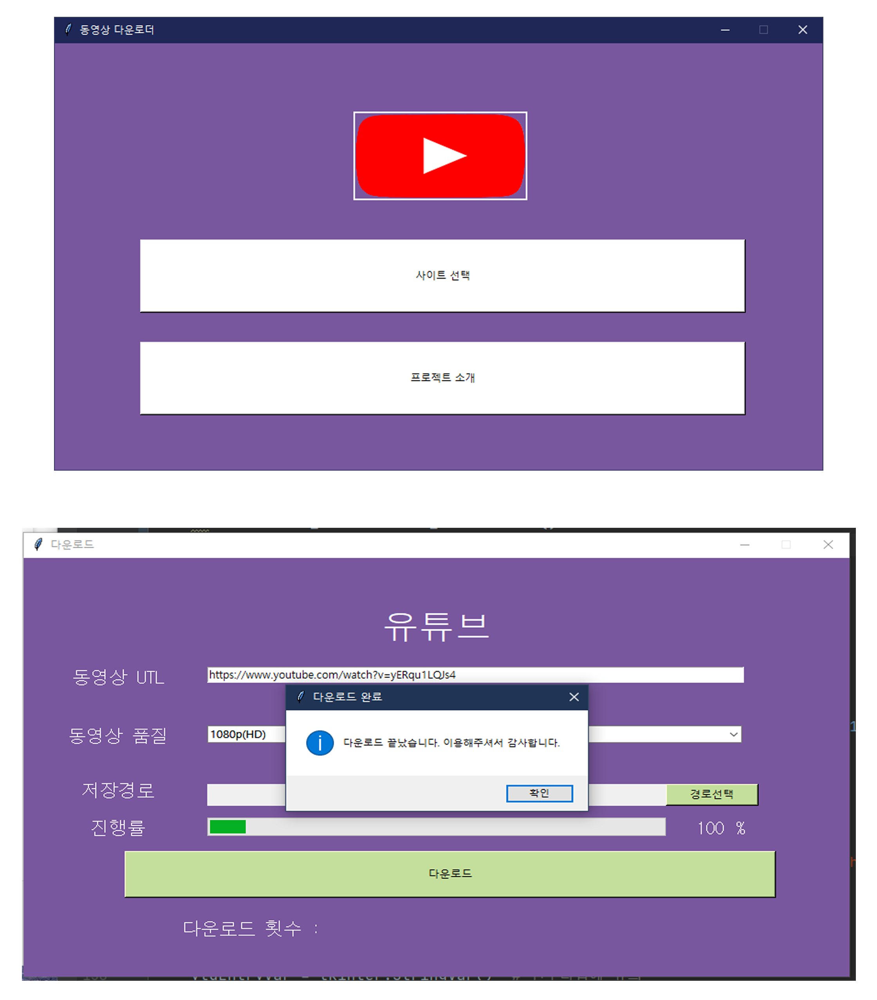
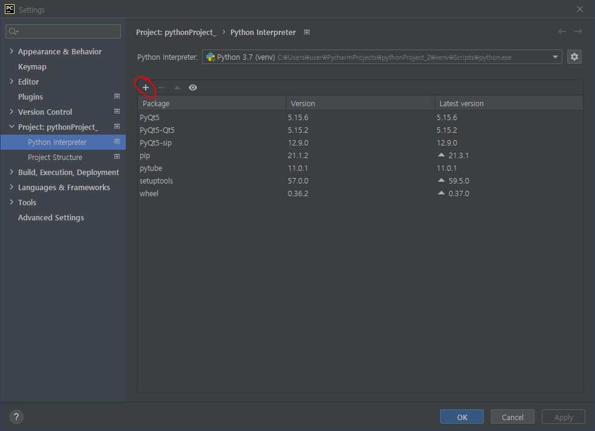

# Python-Tkinter-video-Downloader-Project

파이썬으로 Tkinter 툴킷을 이용해 비디어 다운로더 프로젝트입니다.
(URL 복사해 붙여넣어 동영상 다운로드 해주는 프로그램입니다.)

# 개발 관련 필요 기술
1) Python
2) PyCharm 또는 Visual Studio Code 툴
3) Tkinter 툴킷
4) 판다스(Excel 사용)
5) anaconda(pytude) 모듈추가 : File -> settings -> Project: 프로젝트명 -> Python Interpreter -> + 버튼 클릭 -> pytube 검색 -> Install Package 클릭
   (사진_참고하세요)

